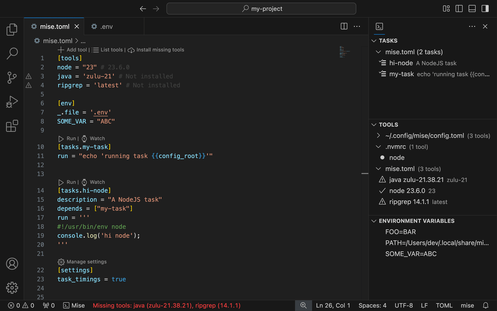

# mise-vscode 🛠️

Visual Studio Code extension for [mise](https://mise.jdx.dev/) (`mise-en-place`). [Documentation](https://hverlin.github.io/mise-vscode/)

> [mise](https://mise.jdx.dev/) is a polyglot tool version manager, environment
> variables manager, and tasks runner.
>
> - Like asdf (or nvm or pyenv but for any language), it manages dev tools like
>   node, python, cmake, terraform, and hundreds more.
> - Like direnv, it manages environment variables for different project
>   directories.
> - Like make, it manages tasks used to build and test projects.

This VSCode extension provides an easy way to manage `mise`
[tasks](https://hverlin.github.io/mise-vscode/reference/tasks/),
[tools](https://hverlin.github.io/mise-vscode/reference/tools/), and
[environment variables](https://hverlin.github.io/mise-vscode/reference/environment-variables/)
directly from your editor.

It can automatically
[configure other extensions](https://hverlin.github.io/mise-vscode/reference/supported-extensions/)
to use tools provided by `mise` in your current project, including support for custom extensions.

## Installation

- [VS Code Marketplace](https://marketplace.visualstudio.com/items?itemName=hverlin.mise-vscode)
- [Open VSX Registry](https://open-vsx.org/extension/hverlin/mise-vscode)

This extension provides basic syntax highlighting for `mise.toml/mise.lock` files. 
For the best experience with syntax highlighting and autocompletion in `mise.toml` files, install one of these TOML extensions:

- [Tombi TOML](https://marketplace.visualstudio.com/items?itemName=tombi-toml.tombi)
- [Even Better TOML](https://marketplace.visualstudio.com/items?itemName=tamasfe.even-better-toml) (works well but [not actively maintained anymore](https://github.com/tamasfe/taplo/issues/715))

The extension will notify you if neither is installed.

## Important Defaults

> [!NOTE]
> The extension includes default settings that you might want to change. See the [configuration guide](https://hverlin.github.io/mise-vscode/tutorials/settinguptheextension/) to customize your set-up.
> For example, you can choose to enable/disable automatic configuration of other extensions or change the path to the `mise` binary.
>
> You can access the settings by clicking on the mise extension indicator in the status bar.

### Recommended: Disable Global Tools in Auto-Configuration

By default, the extension includes tools from your global mise configuration (`~/.config/mise/config.toml`) when auto-configuring other VS Code extensions. This can pollute your project settings with extensions for tools not in your current project.

**Recommended setting:** Set `mise.configureExtensionsIncludeGlobalTools` to `false` to only use tools from your local `mise.toml` file. This keeps your `.vscode/settings.json` clean and ensures extensions are only configured for tools actually used in your project.

## ✨ Features

The mise-vscode extension integrates mise's core functionality into VS Code, helping you manage your development environment directly from the editor. You can handle task running, tool versions, and environment variables through a simple interface. Here's what's available:

### [mise.toml Language Support](https://hverlin.github.io/mise-vscode/reference/misetoml-language-support/)
- 📝 Syntax highlighting for `mise.toml` files (and [tera templates](https://mise.jdx.dev/templates.html))
- 📚 Autocompletion for `mise.toml` files
- 🔗 Go to definition, find references for mise tasks

### [Task Management](https://hverlin.github.io/mise-vscode/reference/tasks/)

- 🔍 Automatic detection of [mise tasks](https://mise.jdx.dev/tasks/)
- ⚡ Run tasks directly from, `mise.toml` files, file tasks, the command palette
  or the activity bar (arguments are supported)
- 📝 View task definitions
- ➕ Create new toml & file tasks
- ⚡ Autocompletion of task dependencies
- 🕸️ View graph of task dependencies

### [Tool Management](https://hverlin.github.io/mise-vscode/reference/tools/)

- 🧰 View all [mise tools](https://mise.jdx.dev/dev-tools/) (python, node, jq,
  etc.) in the sidebar
- 📍 Quick navigation to tool definitions
- 📱 Show tools which are not installed or active
- 📦 Install/Remove/Use tools directly from the sidebar
- 🔧 Configure your other VSCode extensions to use tools provided by `mise`
  ([list of supported extensions](https://hverlin.github.io/mise-vscode/reference/supported-extensions/)). See the [set-up guide](https://hverlin.github.io/mise-vscode/tutorials/settinguptheextension/) for more information.

<video src="https://github.com/user-attachments/assets/c2ad5e60-f011-46a4-8e1b-1da4264f0d09"></video>

### [Environment Variables](https://hverlin.github.io/mise-vscode/reference/environment-variables/)

- ⚙️ View [mise environment variables](https://mise.jdx.dev/environments/)
- 📍 Quick navigation to environment variable definitions
- 🔄 Automatically load environment variables from `mise.toml` files in VS Code

### Snippets

- 📝 Snippets to create tasks in `mise.toml` and task files

### Integration with VSCode tasks (`launch.json`)

This extension lets
[VSCode tasks](https://code.visualstudio.com/docs/editor/tasks) use `mise`
tasks. You can use `mise` tasks in your `launch.json` file.

See the
[VSCode task integration docs section](https://hverlin.github.io/mise-vscode/reference/tasks/#vscode-task-integration)
for more information.

## [Documentation](https://hverlin.github.io/mise-vscode/)

- [Getting Started](https://hverlin.github.io/mise-vscode/tutorials/getting-started/)
- [Important Defaults](https://hverlin.github.io/mise-vscode/tutorials/settinguptheextension/)
- [FAQ](https://hverlin.github.io/mise-vscode/explanations/faq/)

### Reference
- [Tools](https://hverlin.github.io/mise-vscode/reference/tools/)
- [Environment variables](https://hverlin.github.io/mise-vscode/reference/environment-variables/)
- [Tasks](https://hverlin.github.io/mise-vscode/reference/tasks/)
- [mise.toml language support](https://hverlin.github.io/mise-vscode/reference/misetoml-language-support/)
- [Supported extensions](https://hverlin.github.io/mise-vscode/reference/supported-extensions/)
- [Extension Settings](https://hverlin.github.io/mise-vscode/reference/settings/)

### Guides
Setup for [Bun](https://hverlin.github.io/mise-vscode/guides/bun/), [Deno](https://hverlin.github.io/mise-vscode/guides/deno/), [Flutter](https://hverlin.github.io/mise-vscode/guides/flutter/), [Go](https://hverlin.github.io/mise-vscode/guides/golang/), [Java](https://hverlin.github.io/mise-vscode/guides/java/), [Julia](https://hverlin.github.io/mise-vscode/guides/julia/), [Node.JS](https://hverlin.github.io/mise-vscode/guides/node/), [PHP](https://hverlin.github.io/mise-vscode/guides/php/), [Python](https://hverlin.github.io/mise-vscode/guides/python/)

## Bug Reports / Feature Requests / Contributing

- Found a bug? Please
  [open an issue](https://github.com/hverlin/mise-vscode/issues)
- Contributions are welcome! See [CONTRIBUTING.md](CONTRIBUTING.md) for more
  information.

Note that this extension is tested against the latest version of `mise`. If you
encounter an issue, make sure to update `mise` first with `mise self-update` or
using your package manager.

## Ecosystem

- See [intellij-mise](https://github.com/134130/intellij-mise) if you are
  looking for a similar plugin for IntelliJ IDEA
- [Mise documentation](https://mise.jdx.dev/)

## License

This extension is licensed under the MIT License. See the [LICENSE](LICENSE)
file for details.
