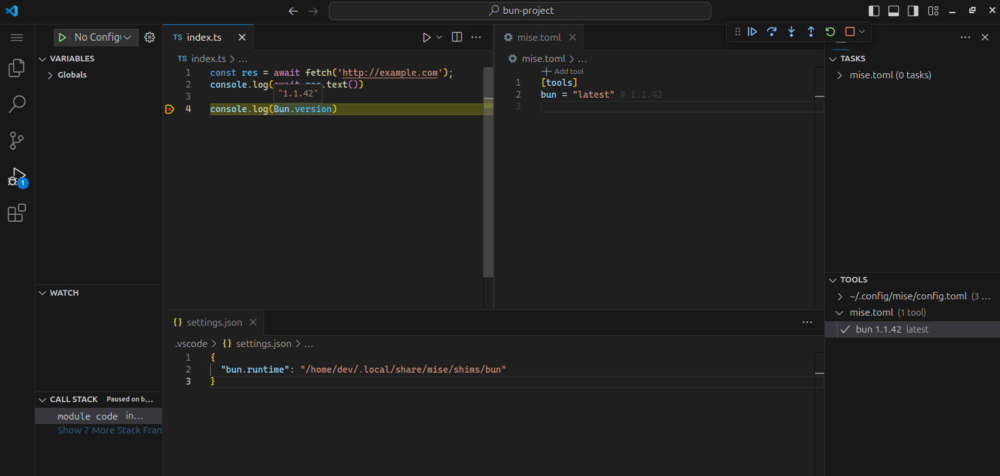

import { Steps } from '@astrojs/starlight/components';

Here are the steps to set up Bun in VS Code with mise:

<Steps>
1. Install the [mise-vscode extension](https://marketplace.visualstudio.com/items?itemName=hverlin.mise-vscode#overview) (if not already installed)
1. Install the [Bun extension](https://marketplace.visualstudio.com/items?itemName=oven.bun-vscode) for VS Code
1. Open a project with a `mise.toml` file (or any other files supported by mise)
</Steps>

If your project has a `mise.toml` file, such as the one below:

```toml [mise.toml]
[tools]
bun = "latest"
```

`mise-vscode` will automatically detect it and set `deno.path` in your workspace settings.



If you want to quickly initialize a Deno project, you can use the following commands:

<Steps>
1. ```shell frame="none"
    mkdir my-bun-project && cd my-bun-project
    ```
1. ```shell frame="none"
   mise use bun@latest
   ```
1. ```shell frame="none"
   bun init . -y
   ```
</Steps>

This will create a new Bun project with a `mise.toml` file that specifies the latest version of Bun.
Open the `index.ts` file in VSCode and click the `run` button, you should be all set!
