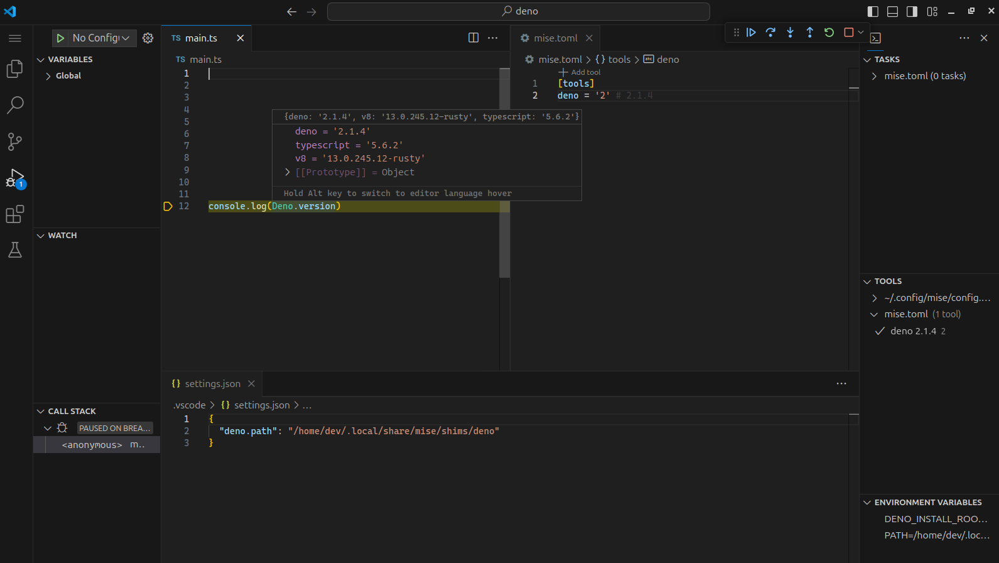

import { Steps } from '@astrojs/starlight/components';

Here is how to set up Deno in VS Code with mise:

<Steps>
1. Install the [mise-vscode extension](https://marketplace.visualstudio.com/items?itemName=hverlin.mise-vscode#overview) (if not already installed)
1. Install the [Deno extension](https://marketplace.visualstudio.com/items?itemName=denoland.vscode-deno) for VS Code
1. Open a project with a `mise.toml` file (or any other files supported by mise)
</Steps>

If your project has a `mise.toml` file, such as the one below:

```toml [mise.toml]
[tools]
deno = "2"
```

`mise-vscode` will automatically detect it and set `deno.path` in your workspace settings.



If you want to quickly initialize a Deno project, you can use the following commands:

<Steps>
1. ```shell frame="none"
   mkdir my-deno-project && cd my-deno-project
    ```
1. ```shell frame="none"
   mise use deno@latest
   ```
1. ```shell title="my-deno-project" frame="none"
   deno init .
   ```
</Steps>

This will create a new Deno project with a `mise.toml` file that specifies the latest version of Deno.
Open the `main.ts` file in VS Code and click the `run` button, you should be all set!
