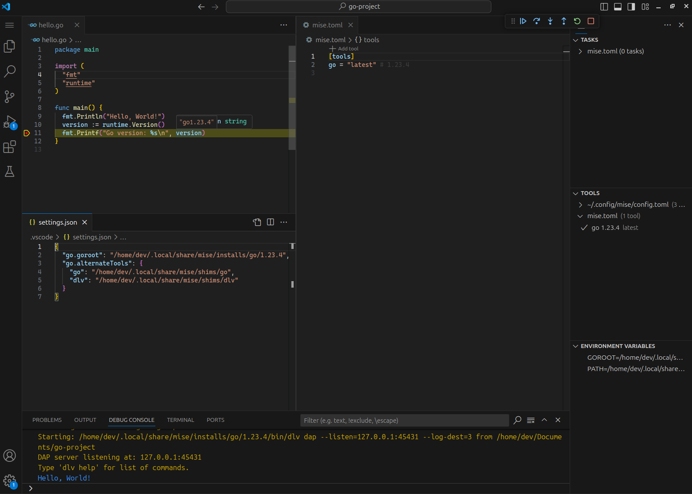

import { Steps } from '@astrojs/starlight/components';

Here are the steps to set up Go in VS Code with mise:

<Steps>
1. Install the [mise-vscode extension](https://marketplace.visualstudio.com/items?itemName=hverlin.mise-vscode#overview) (if not already installed)
1. Install the [Go extension](https://marketplace.visualstudio.com/items?itemName=golang.Go) for VS Code
1. Open a project with a `mise.toml` file (or any other files supported by mise)
</Steps>

If you do not have a `go` project ready and want to quickly try out Go, you can use the following commands:


`mise-vscode` will automatically detect the Go tools in your project and configure the Go extension to use them.



<Steps>
1. ```shell
    mkdir my-go-project && cd my-go-project
    ```
1. ```shell
    mise use go@latest
    ```
1. ```shell
    go mod init example/hello
    ```
1. Open the folder in VS Code and create a new file called `hello.go` with the following content:
    ```go [hello.go]
    package main

    import "fmt"

    func main() {
        fmt.Println("Hello, World!")
    }
    ```
1. Click the `run and debug` button in the editor
</Steps>

If you want to debug a Go program, you will need to install the `dlv` debugger.
You can do this by clicking on the notification that appears when you run a Go file for the first time.


Alternatively, you can install `dlv` manually by running the following command:
```shell
go install -v github.com/go-delve/delve/cmd/dlv@latest
```