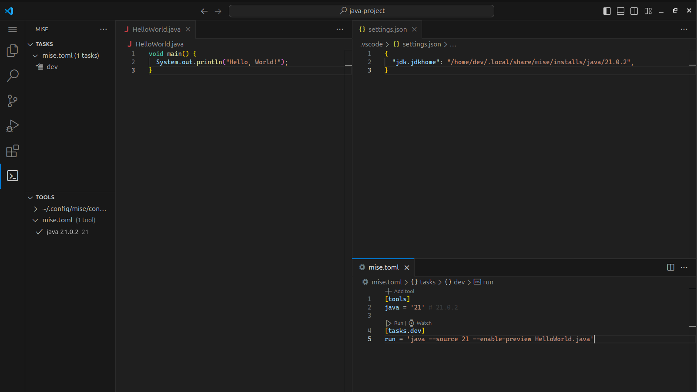

import { Steps } from '@astrojs/starlight/components';

Here is how to set up Java in VS Code with mise:

<Steps>
1. Install the [mise-vscode extension](https://marketplace.visualstudio.com/items?itemName=hverlin.mise-vscode#overview) (if not already installed)
1. Install the [Oracle's Java extension](https://marketplace.visualstudio.com/items?itemName=oracle.oracle-java) or [Language Support for Java by Red Hat](https://marketplace.visualstudio.com/items?itemName=redhat.java) for VS Code
1. Open a project with a `mise.toml` file (or any other files supported by mise)
1. The Java SDK will be automatically detected and configured by `mise-vscode`
</Steps>

Here is an example Java project setup with mise:

The `settings.json` file has been updated with the Java SDK path provided by `mise`.
