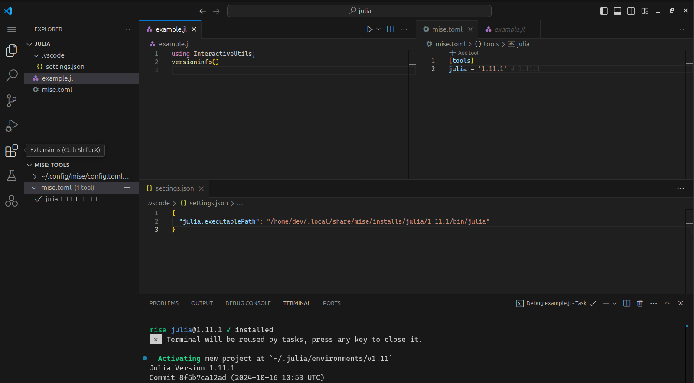

import { Steps } from '@astrojs/starlight/components';

Here are the steps to set up Julia in VS Code with mise:

<Steps>
1. Install the [mise-vscode extension](https://marketplace.visualstudio.com/items?itemName=hverlin.mise-vscode#overview) (if not already installed)
1. Install the [Julia extension](https://marketplace.visualstudio.com/items?itemName=julialang.language-julia) for VS Code
1. Open a project with a `mise.toml` file (or any other files supported by mise)
</Steps>

If your project has a `mise.toml` file, such as the one below:

```toml [mise.toml]
[tools]
julia = "1"
```
`mise-vscode` will automatically detect it and set `julia.executablePath` in your workspace settings.



Note that the Julia extension does not work when using shims. It needs to be the path to the executable (i.e. what `mise which julia` returns)
