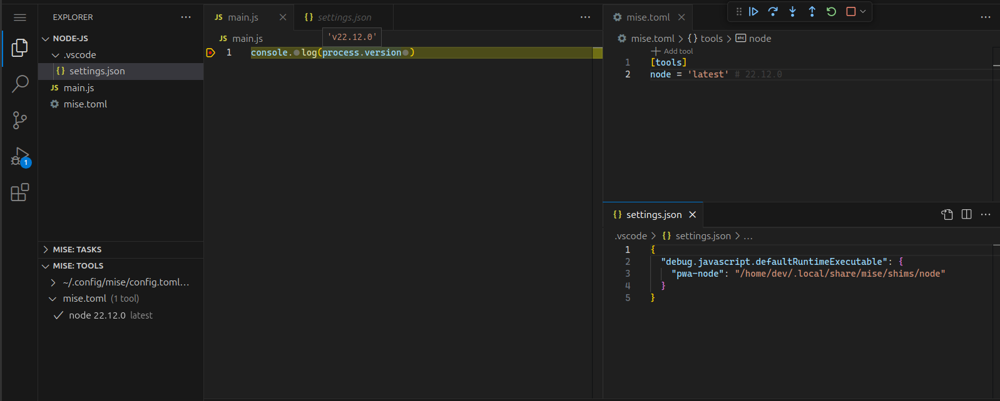

import { Steps } from '@astrojs/starlight/components';

Here are the steps to set up Go in VS Code with mise:

<Steps>
1. Install the [mise-vscode extension](https://marketplace.visualstudio.com/items?itemName=hverlin.mise-vscode#overview) (if not already installed)
1. Open a project with a `mise.toml` file (or any other files supported by mise)
</Steps>

The [NodeJS  (js-debug)](https://marketplace.visualstudio.com/items?itemName=ms-vscode.js-debug) extension is bundled with VS Code.

In this example, you can see that the NodeJS SDK was automatically detected and configured by `mise-vscode`.
We can see that the correct version of NodeJS is used when using the debugger.

