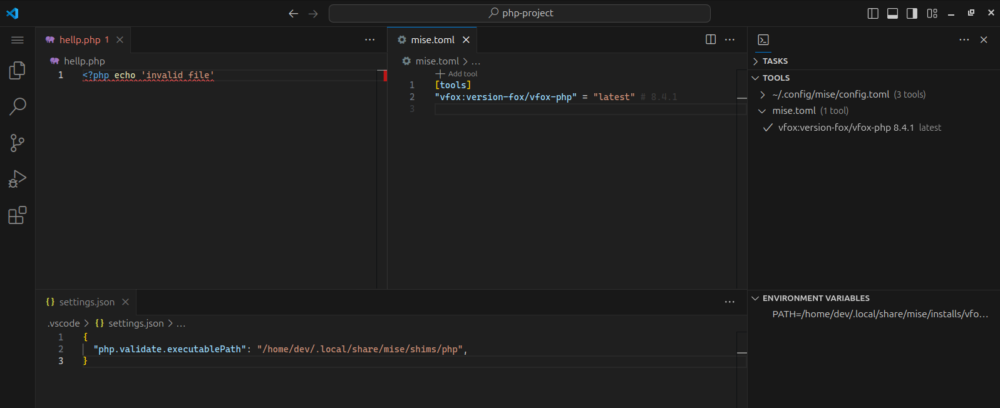
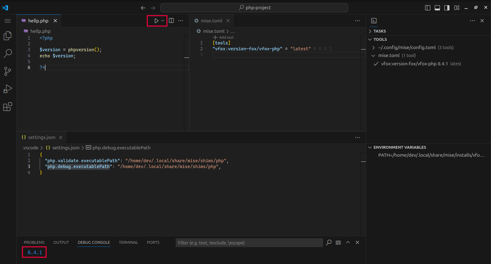
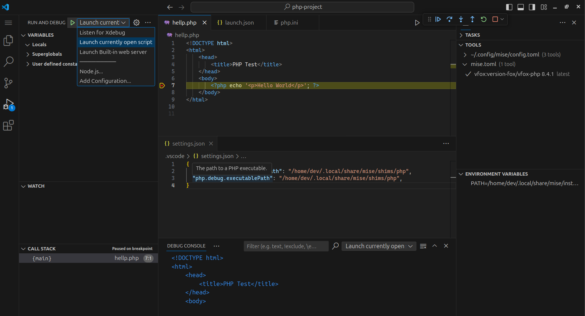
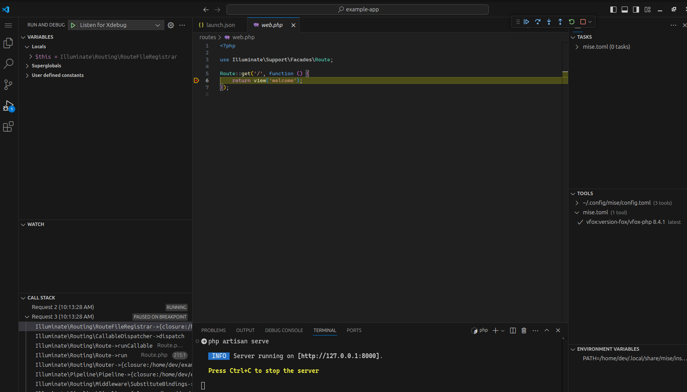

import { Steps, Tabs, TabItem } from '@astrojs/starlight/components';

Here are the steps to set up PHP in VS Code with mise:

<Steps>
1. Install the [mise-vscode extension](https://marketplace.visualstudio.com/items?itemName=hverlin.mise-vscode#overview) (if not already installed)
1. Open a project with a `mise.toml` file (or any other files supported by mise)
</Steps>


## Installing PHP

### vfox-php

I would recommend using the `vfox-php` toolchain for PHP development.

This will require you to install some system dependencies, see https://github.com/version-fox/vfox-php?tab=readme-ov-file#prerequirements for more information.


<Tabs>
  <TabItem label="Mac (Homebrew)">
  ```shell
  brew install autoconf automake bison freetype gd gettext icu4c krb5 libedit libiconv libjpeg libpng libxml2 libxslt libzip pkg-config re2c zlib
  ```
  </TabItem>
  <TabItem label="Debian/Ubuntu">
  ```shell
   sudo apt-get update && sudo apt-get install -y autoconf bison build-essential curl gettext git libgd-dev libcurl4-openssl-dev libedit-dev libicu-dev libjpeg-dev libmysqlclient-dev libonig-dev libpng-dev libpq-dev libreadline-dev libsqlite3-dev libssl-dev libxml2-dev libxslt-dev libzip-dev openssl pkg-config re2c zlib1g-dev
   ```
  </TabItem>
</Tabs>

```shell
mise use vfox:version-fox/vfox-php
```

This will compile and install the latest version of PHP on your system (note that this may take a few minutes).

If you want to install it globally, use:
```shell
mise use -g vfox:version-fox/vfox-php
```

### asdf-php

This will show you how to install PHP using the default `mise` provided `asdf-php` plugin.

<details>
<summary>Installation details</summary>
Currently, the default `php` provided `mise` is the [asdf-php](https://github.com/asdf-community/asdf-php) plugin.
This plugin requires a few dependencies to be installed on your system. See [the asdf-php README](https://github.com/asdf-community/asdf-php) for more information.

<Tabs>
  <TabItem label="Mac (Homebrew)">
  ```shell
  brew install autoconf automake bison freetype gd gettext icu4c krb5 libedit libiconv libjpeg libpng libxml2 libzip pkg-config re2c zlib
  ```
  </TabItem>
  <TabItem label="Ubuntu">
  ```shell
   sudo apt-get update && sudo apt-get install -y autoconf bison build-essential curl gettext git libgd-dev libcurl4-openssl-dev libedit-dev libicu-dev libjpeg-dev libmysqlclient-dev libonig-dev libpng-dev libpq-dev libreadline-dev libsqlite3-dev libssl-dev libxml2-dev libzip-dev openssl pkg-config re2c zlib1g-dev
   ```
  </TabItem>
</Tabs>

You can now install `php` using `mise`:

```shell
mise use asdf:asdf-community/asdf-php
```

This will compile and install the latest version of PHP on your system (note that this may take a few minutes).

</details>

## Default PHP support

The default [PHP support](https://code.visualstudio.com/docs/languages/php) in `vscode` is limited to syntax highlighting and basic code completion. It also runs the `php` linter on save by default.
`mise-vscode` will configure the `php.validate.executablePath` allowing VSCode to run the PHP linter.



You can find the default `php` extension by searching for `@builtin php-language-features` in the extensions view.

## PHP debugger setup

If you wan to run and debug PHP files from VSCode, you will need to install additional extensions.
The extension supported by `mise-vscode` is [PHP X-Debug extension](https://marketplace.visualstudio.com/items?itemName=xdebug.php-debug)

If you install it, `mise-vscode` will automatically configure the `php.debug.executablePath` setting in your workspace settings.

### Running PHP files
You should now be able to run PHP files from VSCode.



### Debugging PHP files

You will need to install `xdebug`. Open a terminal in VSCode and run the following command:
```shell
pecl install xdebug
```

Inspect the output of the command. The last line you should like this:
```shell
# ...
You should add "zend_extension=/home/dev/.local/share/mise/installs/vfox-version-fox-vfox-php/8.4.1/lib/php/extensions/no-debug-non-zts-20240924/xdebug.so" to php.ini
```

Open the `php.ini` file (you can find it by running `php --ini`) and add the line to the end of the file.

You can now debug PHP files from VSCode:
- Go to the debug view in the sidebar
- Create the default `launch.json` file
- The default target "Launch currently open script" should allows you to run and debug PHP files.



## Example with laravel

```shell
mise exec vfox:version-fox/vfox-php -- composer create-project laravel/laravel example-app
cd example-app
mise use vfox:version-fox/vfox-php
php artisan serve
```

Open http://127.0.0.1:8000/ in your browser to see the Laravel welcome page.

You can now open the `example-app` folder in VSCode.

To enable debugging, update your `php.ini` (use `php --ini` to find it) file with the following:

```text
zend_extension=... # same as in the `PHP debugger setup` section

xdebug.start_with_request=yes ;
xdebug.mode=develop,gcstats,coverage,profile,debug
xdebug.idekey=VSCODE
xdebug.client_port=9003 ;
```

You can now set breakpoints in your code and start debugging.
- Run `php artisan serve` in the terminal
- Go to the debug view in the sidebar
- Click the `Listen for XDebug` button


