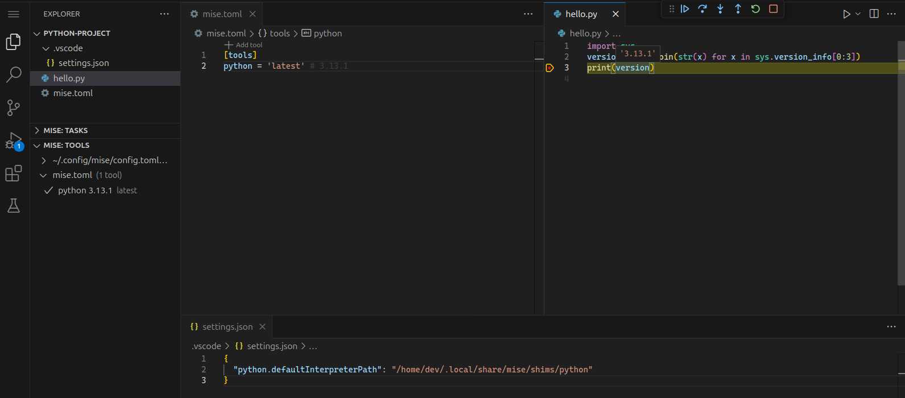
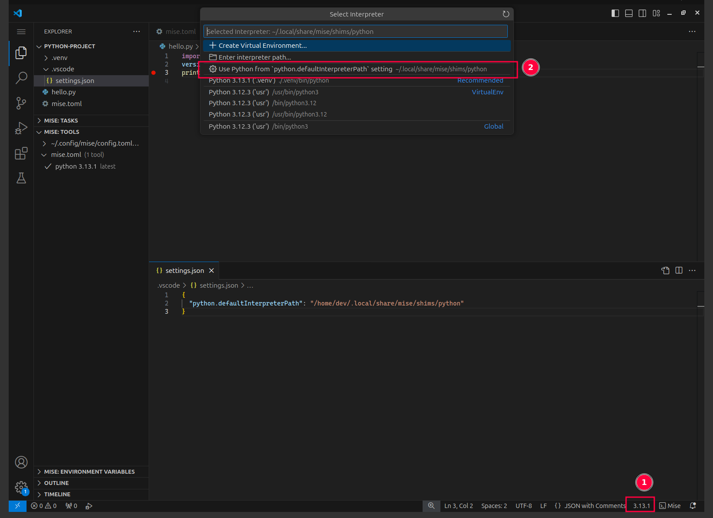

import { Steps } from '@astrojs/starlight/components';

Here is how to set up python in VS Code with mise:

<Steps>
1. Install the [mise-vscode extension](https://marketplace.visualstudio.com/items?itemName=hverlin.mise-vscode#overview) (if not already installed)
1. Install the [python extension](https://marketplace.visualstudio.com/items?itemName=ms-python.python) for VS Code
1. Open a project with a `mise.toml` file (or any other files supported by mise)
</Steps>



If your project contains a `mise.toml` file, such as the one below:

```toml [mise.toml]
[tools]
python = "3.13"
```

`mise-vscode` will automatically detect it and set `python.defaultInterpreterPath` in your workspace settings.

If your `mise.toml` file references a `venv` like:

```toml [mise.toml]
[tools]
python = 'latest'

[env]
_.python.venv = { create = true, path = '.venv' }
```

`mise-vscode` will detect it and set your workspace settings to use the `venv` as the default interpreter.
```json [.vscode/settings.json]
{
  "python.defaultInterpreterPath": "${workspaceFolder}/.venv"
}
```

The VS Code python extension does not use the `python.defaultInterpreterPath` setting if an interpret was previously set (see [this document](https://github.com/microsoft/vscode-python/wiki/Setting-descriptions) for more details.

For this reason, you might need to manually switch the python interpreter if the wrong one was selected by the python extension.

<Steps>
1. Open a python file
1. In the status bar, click on the python interpreter version
1. Select the correct interpreter from the list. The interpreter provided by `mise` should be the one provided by `python.defaultInterpreterPath`.
</Steps>



