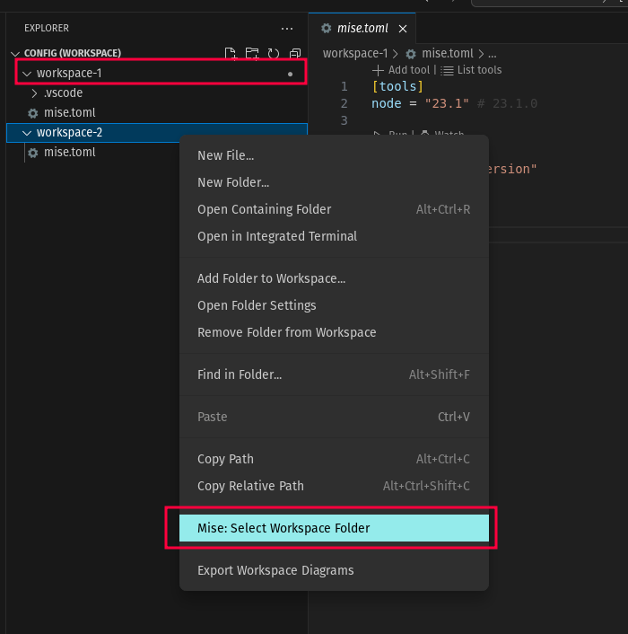

If you are using a workspace with multiple root folders (see [multi-root workspaces](https://code.visualstudio.com/docs/editor/multi-root-workspaces)), you can specify the current workspace folder to use using the command palette `mise: Select Workspace Folder` or using the context menu in the explorer.

In this screenshot, the currently selected folder is `workspace-1` (indicated by the small `●` icon).
