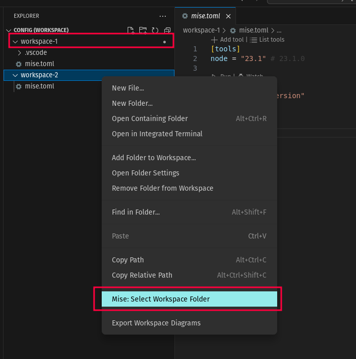

If you are using a workspace with multiple root folders (see [multi-root workspaces](https://code.visualstudio.com/docs/editor/multi-root-workspaces)), you can specify the current workspace folder to use using the command palette `mise: Select Workspace Folder` or using the context menu in the explorer.

In this screenshot, the currently selected folder is `workspace-1` (indicated by the small `●` icon).

The selected folder is the one shown in the sidebar views (tools, tasks, environment variables) and the one used to run mise commands.

## Extension settings

When [automatic extension configuration](/mise-vscode/reference/settings/#miseconfigureextensionsautomatically) runs in a multi-root workspace, each folder is configured with the tools of its own mise config. Settings are written at the folder level when the target extension supports it, so two folders pinning different versions of the same tool each get their own version. Settings that only exist per window are taken from the selected folder.
