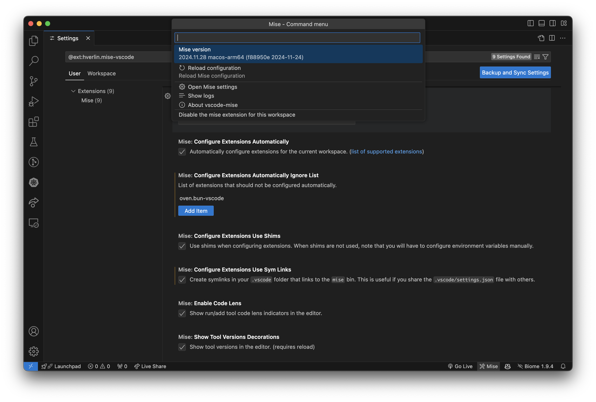

You can configure the extension behavior through Visual Studio Code settings. To
access the settings:

1. Open the Command Palette (`Ctrl+Shift+P` / `Cmd+Shift+P`)
2. Type "Settings: Open Settings (UI)"
3. Search for "Mise"

You can also click on the mise extension indicator in the status bar to quickly
access the extension settings.

## Settings

##### `mise.enable`
- **Type:** `boolean`
- **Default:** `true`

Enable/disable mise extension.

---

##### `mise.binPath`
- **Type:** `string`
Path to the mise binary (automatically detected on startup).

See https://mise.jdx.dev/getting-started.html to install mise.

---

##### `mise.miseEnv`
- **Type:** `string`
Mise environment to use. (https://mise.jdx.dev/configuration/environments.html)

---

##### `mise.configureExtensionsAutomatically`
- **Type:** `boolean`
- **Default:** `true`

Automatically configure extensions for the current workspace. ([list of supported extensions](https://github.com/hverlin/mise-vscode/wiki/Supported-extensions))

---

##### `mise.configureExtensionsAutomaticallyIgnoreList`
- **Type:** `array` (array of `string`)
- **Default:** `[]`

List of extensions that should not be configured automatically.

**Available options:**

- `ms-python.python`
- `denoland.vscode-deno`
- `charliermarsh.ruff`
- `golang.go`
- `oven.bun-vscode`
- `oracle.oracle-java`
- `timonwong.shellcheck`
- `ms-vscode.js-debug`
- `vscode.php-language-features`
- `xdebug.php-debug`
- `julialang.language-julia`
- `pgourlain.erlang`
- `Dart-Code.dart-code`
- `dart-code.flutter`
- `ziglang.vscode-zig`

---

##### `mise.configureExtensionsUseShims`
- **Type:** `boolean`
- **Default:** `true`

Use shims when configuring extensions. When shims are not used, note that you will have to configure environment variables manually.

---

##### `mise.configureExtensionsUseSymLinks`
- **Type:** `boolean`
- **Default:** `false`

Create symlinks in your `.vscode` folder that links to the `mise` bin. This is useful if you share the `.vscode/settings.json` file with others.

---

##### `mise.enableCodeLens`
- **Type:** `boolean`
- **Default:** `true`

Show run/add tool code lens indicators in the editor.

---

##### `mise.showToolVersionsDecorations`
- **Type:** `boolean`
- **Default:** `true`

Show tool versions in the editor. (requires reload)

---

##### `mise.checkForNewMiseVersion`
- **Type:** `boolean`
- **Default:** `true`

Check if a new mise version is available on startup.

---

##### `mise.updateEnvAutomatically`
- **Type:** `boolean`
- **Default:** `true`

Update VSCode and terminal environment variables automatically based on the mise configuration. Note that depending on the extensions loading order, other extensions might not see all mise environment variables.

---

##### `mise.updateOpenTerminalsEnvAutomatically`
- **Type:** `boolean`
- **Default:** `false`

Update terminal environment variables automatically based on the mise configuration. This will send `unset` and `eval $(mise env)` commands to the terminal. If you don't enable this, you will need to restart the integrated terminals to get the new environment variables.

---

##### `mise.teraAutoCompletion`
- **Type:** `boolean`
- **Default:** `true`

Enable experimental Tera auto-completion in `mise.toml` files.

---

##### `mise.automaticallyTrustMiseConfigFiles`
- **Type:** `boolean`
- **Default:** `true`

Automatically trust mise config files when opening them in a trusted worskspace.

---

