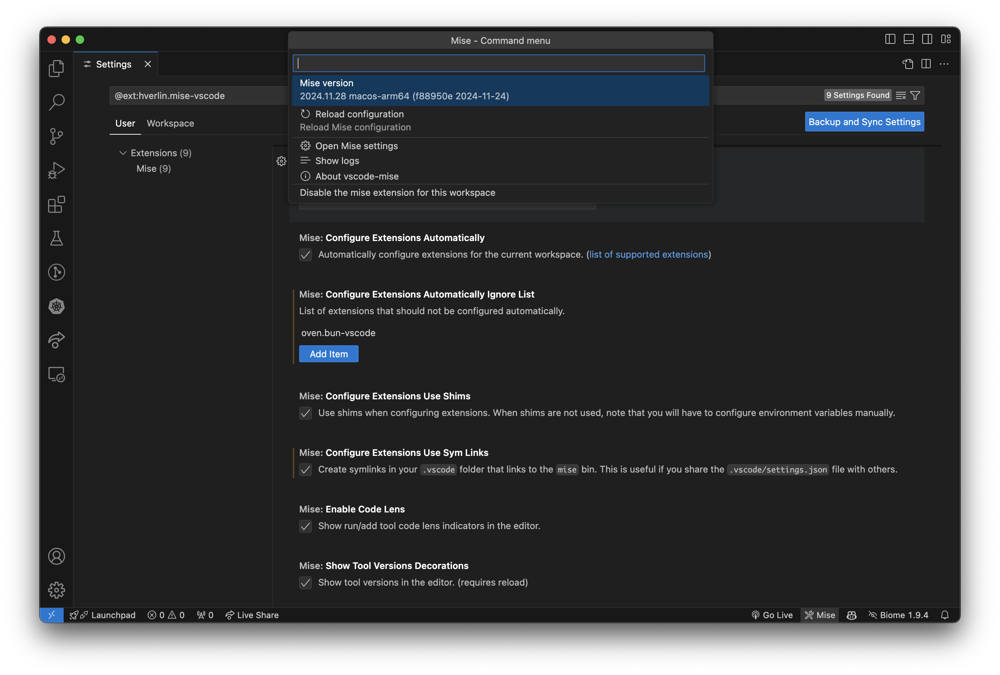

You can configure the extension behavior through Visual Studio Code settings. To
access the settings:

1. Open the Command Palette (`Ctrl+Shift+P` / `Cmd+Shift+P`)
2. Type "Settings: Open Settings (UI)"
3. Search for "Mise"

You can also click on the mise extension indicator in the status bar to quickly
access the extension settings.

## Settings

##### `mise.skipWorkspaceBinaryApproval`
- **Type:** `boolean`
- **Default:** `false`

Run a mise binary located inside the workspace without asking for approval first.

**This turns off a security check.** A repository can point `mise.binPath` at a program it ships, and with this enabled that program runs as soon as you open the project. Useful if you rely on a committed launcher such as the one written by `mise generate bootstrap -l -w`.

You still have to trust the folder in VS Code first: the extension does not run in an untrusted workspace at all. This setting is machine-scoped, so a project cannot enable it for you.

---

##### `mise.enable`
- **Type:** `boolean`
- **Default:** `true`

Enable/disable mise extension.

---

##### `mise.binPath`
- **Type:** `string`
- **Default:** `"mise"`

Path to the mise binary (automatically detected on startup).

If set to `mise` (default), it will use `mise` available in `PATH`.

Relative paths (e.g. `./bin/mise`) and `${workspaceFolder}` variables are resolved against the workspace folders.

See https://mise.jdx.dev/getting-started.html to install mise.

---

##### `mise.miseEnv`
- **Type:** `string`
Mise environment to use. (https://mise.jdx.dev/configuration/environments.html)

---

##### `mise.configureExtensionsAutomatically`
- **Type:** `boolean`
- **Default:** `false`

Automatically configure extensions for the current workspace. ([list of supported extensions](https://github.com/hverlin/mise-vscode/wiki/Supported-extensions)).

This will modify your workspace settings (`.vscode/settings.json`). You can use the ignore/include lists settings to customize which extensions are configured.

---

##### `mise.configureExtensionsAutomaticallyIgnoreList`
- **Type:** `array` (array of `string`)
- **Default:** `[]`

List of extensions that should not be configured automatically.

**Available options:**

- `ms-python.python`
- `denoland.vscode-deno`
- `charliermarsh.ruff`
- `golang.go`
- `oven.bun-vscode`
- `oracle.oracle-java`
- `redhat.java`
- `vscjava.vscode-gradle`
- `salesforce.salesforcedx-vscode-apex`
- `timonwong.shellcheck`
- `ms-vscode.js-debug`
- `vscode.php-language-features`
- `xdebug.php-debug`
- `julialang.language-julia`
- `pgourlain.erlang`
- `Dart-Code.dart-code`
- `dart-code.flutter`
- `ziglang.vscode-zig`
- `signageos.signageos-vscode-sops`
- `joselitofilho.ginkgotestexplorer`
- `bufbuild.vscode-buf`
- `biomejs.biome`
- `oxc.oxc-vscode`
- `bazelbuild.vscode-bazel`
- `swiftlang.swift-vscode`
- `Pkl.pkl-vscode`
- `exiasr.hadolint`
- `astral-sh.ty`
- `foxundermoon.shell-format`
- `sumneko.lua`
- `twxs.cmake`
- `ms-dotnettools.vscode-dotnet-runtime`
- `SonarSource.sonarlint-vscode`

---

##### `mise.configureExtensionsAutomaticallyIncludeList`
- **Type:** `array` (array of `string`)
- **Default:** `[]`

List of extensions that should be configured automatically. If both include and ignore lists are set, the ignore list takes precedence. If the include list includes 'all' (default), all supported extensions are considered except those in the ignore list.

**Available options:**

- `all`
- `ms-python.python`
- `denoland.vscode-deno`
- `charliermarsh.ruff`
- `golang.go`
- `oven.bun-vscode`
- `oracle.oracle-java`
- `redhat.java`
- `vscjava.vscode-gradle`
- `salesforce.salesforcedx-vscode-apex`
- `timonwong.shellcheck`
- `ms-vscode.js-debug`
- `vscode.php-language-features`
- `xdebug.php-debug`
- `julialang.language-julia`
- `pgourlain.erlang`
- `Dart-Code.dart-code`
- `dart-code.flutter`
- `ziglang.vscode-zig`
- `signageos.signageos-vscode-sops`
- `joselitofilho.ginkgotestexplorer`
- `bufbuild.vscode-buf`
- `biomejs.biome`
- `oxc.oxc-vscode`
- `bazelbuild.vscode-bazel`
- `swiftlang.swift-vscode`
- `Pkl.pkl-vscode`
- `exiasr.hadolint`
- `astral-sh.ty`
- `foxundermoon.shell-format`
- `sumneko.lua`
- `twxs.cmake`
- `ms-dotnettools.vscode-dotnet-runtime`
- `SonarSource.sonarlint-vscode`

---

##### `mise.configureExtensionsUseShims`
- **Type:** `boolean`
- **Default:** `true`

Use shims when configuring extensions. When shims are not used, note that you will have to configure environment variables manually.

---

##### `mise.configureExtensionsUseSymLinks`
- **Type:** `boolean`
- **Default:** `false`

Create symlinks in your `.vscode` folder that links to the `mise` bin.

This is useful if you share the `.vscode/settings.json` file with others. When the project is version controlled:
- every user must have the extension installed
- the directory `.vscode/mise-tools` must be excluded from version control.

The folder where the symlinks are created can be changed with `mise.configureExtensionsSymLinksFolder`.

---

##### `mise.configureExtensionsSymLinksFolder`
- **Type:** `string`
- **Default:** `".vscode/mise-tools"`

Folder in which `mise.configureExtensionsUseSymLinks` creates the symlinks to the `mise` tools. Relative paths are resolved from the workspace folder (absolute paths are also supported).

Useful if you use a VS Code fork that stores its settings in a different folder (e.g. `.cursor/mise-tools` for Cursor, `.windsurf/mise-tools` for Windsurf), or if you prefer to keep the symlinks outside of `.vscode` (e.g. `.mise-tools`).

---

##### `mise.configureExtensionsIncludeGlobalTools`
- **Type:** `boolean`
- **Default:** `true`

When enabled, tools from the global mise configuration (`~/.config/mise/config.toml`) will be included when automatically configuring VS Code extensions.

When disabled (recommended), only tools from the local project configuration (`mise.toml`) are used. This prevents settings.json from being polluted with extensions for tools that are not part of the current project.

---

##### `mise.checkForNewMiseVersion`
- **Type:** `boolean`
- **Default:** `true`

Check if a new mise version is available on startup.

---

##### `mise.keepReplacedVersionOnUpgrade`
- **Type:** `boolean`
- **Default:** `false`

Pass `--no-prune` to `mise upgrade` so the version being replaced stays installed. Useful when something outside of mise still points at it, such as a virtualenv built from a mise-managed Python.

Requires mise 2026.8.1 or later; ignored on older versions.

---

##### `mise.showToolVersionsDecorations`
- **Type:** `boolean`
- **Default:** `true`

Show tool versions in the editor. (requires reload)

---

##### `mise.showToolEnvVarsDecorations`
- **Type:** `boolean`
- **Default:** `true`

Show environment variables contributed by each tool in the editor inline decorations (e.g. `GOBIN`, `GOROOT` for Go).

---

##### `mise.enableCodeLens`
- **Type:** `boolean`
- **Default:** `true`

Show run/add tool code lens indicators in the editor.

---

##### `mise.enableToolLinks`
- **Type:** `boolean`
- **Default:** `true`

Enable document links for tools in mise configuration files.

---

##### `mise.enableTaskSymbolProvider`
- **Type:** `boolean`
- **Default:** `false`

Enable document symbol provider for mise TOML files. Provides an outline of tasks, tools, env, and settings sections. This is always enabled on the web. On desktop, you can use [Tombi](https://marketplace.visualstudio.com/items?itemName=tombi-toml.tombi) for better TOML support.

---

##### `mise.resolveMonorepoProjectConfigs`
- **Type:** `boolean`
- **Default:** `true`

Show the tools and environment variables of each [monorepo](https://mise.jdx.dev/tasks/monorepo.html) project. This spawns one mise process per project when the configuration is loaded. Disable this in large monorepos if reloads feel slow.

---

##### `mise.showNotificationIfMissingTools`
- **Type:** `boolean`
- **Default:** `true`

Show notification if tools are not installed.

---

##### `mise.updateEnvAutomatically`
- **Type:** `boolean`
- **Default:** `true`

Update VSCode and terminal environment variables automatically based on the mise configuration. Note that depending on the extensions loading order, other extensions might not see all mise environment variables.

---

##### `mise.updateEnvAutomaticallyIncludePath`
- **Type:** `boolean`
- **Default:** `true`

Include the PATH variable when updating VSCode and terminal environment variables. Disable this if you want to keep your original PATH.

---

##### `mise.updateOpenTerminalsEnvAutomatically`
- **Type:** `boolean`
- **Default:** `false`

Update terminal environment variables automatically based on the mise configuration. This will send `unset` and `eval $(mise env)` commands to the terminal. If you don't enable this, you will need to restart the integrated terminals to get the new environment variables.

---

##### `mise.teraAutoCompletion`
- **Type:** `boolean`
- **Default:** `true`

Enable Tera auto-completion in `mise.toml` files.

---

##### `mise.automaticallyTrustMiseConfigFiles`
- **Type:** `boolean`
- **Default:** `true`

Automatically trust mise config files when opening them in a trusted worskspace.

---

##### `mise.commandTTLCacheSeconds`
- **Type:** `number`
- **Default:** `2`

Time to live in seconds for the mise command cache. Only changed it if some commands are expensive to run.

---

##### `mise.showOutdatedToolGutterDecorations`
- **Type:** `boolean`
- **Default:** `true`

Show outdated tool gutter decorations in the editor.

---

##### `mise.autoDetectMiseBinPath`
- **Type:** `boolean`
- **Default:** `true`

Auto-detect mise bin path on startup.

---

##### `mise.customBinaryExtensions`
- **Type:** `array` (array of `object`)
- **Default:** `[]`

Custom binary extensions to automatically configure VSCode extensions with mise tool binaries.

Each entry requires:
- `extensionId`: VSCode extension ID
- `toolSources`: Array of tool names to match. Both the registry short name (e.g. `shfmt`) and the backend source (e.g. `aqua:mvdan/sh`) match, whichever one mise.toml declares
- `vscodeSetting.key`: VSCode setting key to write

Optional:
- `binName`: Binary name (defaults to first tool name)
- `vscodeSetting.subdirs`: Subdirectories to append to the path
- `vscodeSetting.asArray`: Whether to wrap the setting value in an array (default: false)
- `supportsShims`: Whether extension supports shims (default: true)
- `supportsSymlinks`: Whether extension supports symlinks (default: true)

---

##### `mise.customFolderExtensions`
- **Type:** `array` (array of `object`)
- **Default:** `[]`

Custom folder extensions to automatically configure VSCode extensions with mise tool folders.

Each entry requires:
- `extensionId`: VSCode extension ID
- `toolSources`: Array of tool names to match. Both the registry short name (e.g. `shfmt`) and the backend source (e.g. `aqua:mvdan/sh`) match, whichever one mise.toml declares
- `vscodeSetting.key`: VSCode setting key to write
- `folderName`: Name for the symlink folder

Optional:
- `vscodeSetting.subdirs`: Subdirectories to append to the path written to VSCode setting
- `sourceSubdirs`: Additional subdirs to find the tool source folder
- `supportsSymlinks`: Whether extension supports symlinks (default: true)

---

