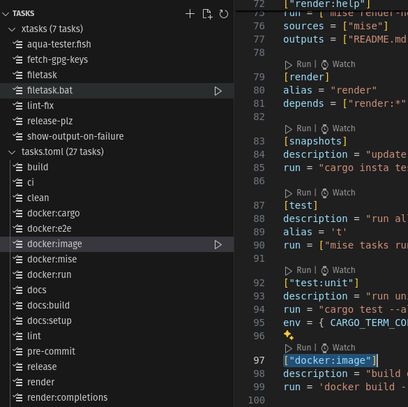
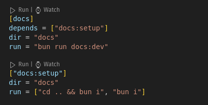
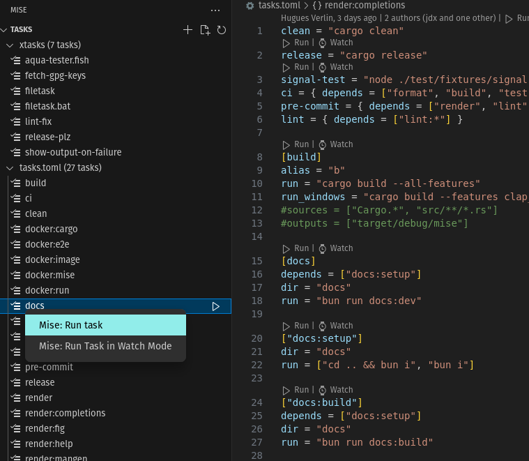
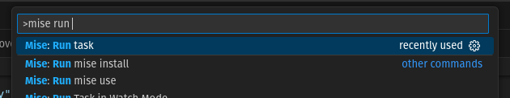
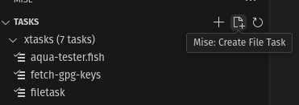
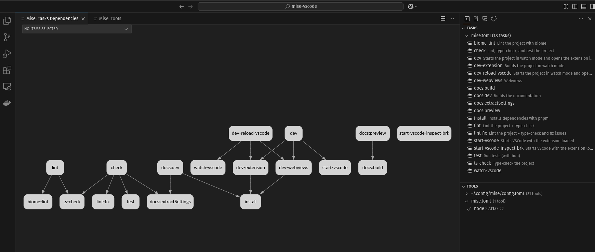

## Finding tasks

Here are a few ways to find tasks in your project:

### Using the mise activity bar



Click on a task to navigate to the file where the task is defined.

### Using the command palette

Using the command palette: `cmd|ctrl+shift+p` and search for
`Mise: Open task definition`.

## Running a task

You have several ways to run a task with the extension:

### Using the run task code lens action



Click on the run button to run the task. If some option/arguments are required,
you will be prompted to enter them.

### Using the mise activity bar



Click on the run action, or use right-click -> run task

### Using the command palette

Using the command palette: `cmd|ctrl+shift+p`, search for `Mise: run task`.
Press enter.



### VS Code task integration

This extension lets
[VS Code tasks](https://code.visualstudio.com/docs/editor/tasks) use `mise`
tasks. You can use `mise` tasks in your `launch.json` file. This allows you to
create your own shortcuts to run tasks

```json title=launch.json {5,6}
{
    "version": "2.0.0",
    "tasks": [
        {
            "type": "mise",
            "task": "build-my-app",
            "label": "Build my app",
            "watch": true
        }
    ]
}
```

**Supported parameters for mise tasks**

- `task`: The mise task to execute
- `watch`: Re-run the task when files change
- `miseEnv`: The
  [mise env](https://mise.jdx.dev/configuration/environments.html) to use
  (optional, will use the default miseEnv if not provided)
- `glob`: Glob pattern to watch for changes. Defaults to sources from the tasks
- `runArgs`: Arguments to pass to the task. Not used when watch is true
- `watchexecArgs`: Arguments to pass to `watchexec`. (example: `--clear`) | use
  `watchexec --help` for more information

## Creating a task

### Using the activity bar

You can create a file task or a toml task directly from the activity bar



### Using the command palette

Using the command palette: `cmd|ctrl+shift+p`, search for
`Mise: Create File task` or `Mise: Create Toml Task`

## Task dependencies

You can visualize the dependencies of a task by using the `Mise: Visualize Tasks Dependencies` command.



## Monorepo tasks

The extension supports
[mise monorepo tasks](https://mise.jdx.dev/tasks/monorepo.html) (`monorepo_root = true`).
This requires mise `2025.10.3` or later. Workspace script tasks and the project
graph require a recent mise version.

Tasks are shown with their fully qualified names (`//projects/frontend:build`)
and can be run from the activity bar, code lenses, the command palette, and the
VS Code tasks API. In the activity bar, tasks are grouped by their config file,
with each project's files listed together.

Navigation understands all the ways tasks can reference each other:

- `depends = ["build"]` — a task of the same project
- `depends = [":build"]` — explicit same-project reference
- `depends = ["//projects/frontend:build"]` — fully qualified reference
- `depends = ["//projects/...:build"]`, `depends = ["//projects/frontend:*"]` —
  wildcards. Hovering shows all the matching tasks, and go-to-definition opens
  each of them.
- task aliases (`alias = "fmt"`), including in other projects

### package.json scripts

If the monorepo defines a Node workspace (`workspaces` in the root
`package.json`, or `pnpm-workspace.yaml`), mise exposes each package's scripts
as tasks (e.g. `node:frontend#test`, also addressable as
`//projects/frontend:test`). These tasks appear in the activity bar under their
`package.json` file and can be run like any other task. Go-to-definition on a
reference to such a task jumps to the script in the `package.json` file.

### Workspace projects graph

`Mise: Visualize task dependencies` (also available from the mise status bar
menu, under _Task dependencies_) shows the workspace project graph inferred by
mise from ecosystem manifests, in addition to the task dependency graph.

### Tools and environment variables

Tools and environment variables declared in a monorepo project config (e.g.
`projects/frontend/mise.toml`) are shown in the Tools and Environment variables
views, grouped under their config file. Note that the environment injected into
the VS Code terminal and the automatic SDK configuration still use the
workspace root configuration.

Resolving them spawns one mise process per project when the configuration is
loaded. In large monorepos, you can disable this with the
`mise.resolveMonorepoProjectConfigs` setting.
