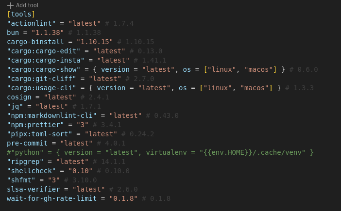
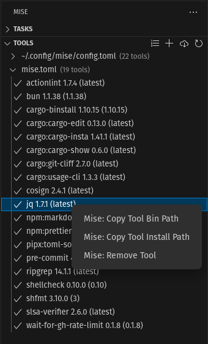
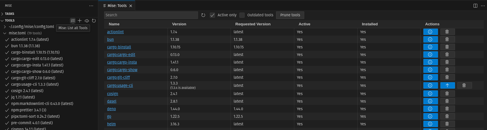

## Tools versions

The extension will show the currently installed tool versions directly in the
editor

## Tool explorer (activity bar)

The tool explorer in the activity bar allows you to quickly which tools are used
in the current project. You can also the list of global tools.

- Click on a tool to navigate to the file where it is defined
- Some additional options are available on right-click, like copying the
  bin/install path or removing the tool

## Tools list

Use the list `List all tools` button to list all installed tools.

- You can filter the tools used in the current project using `active` only.
- From there, you can upgrade, uninstall or prune unused tools

