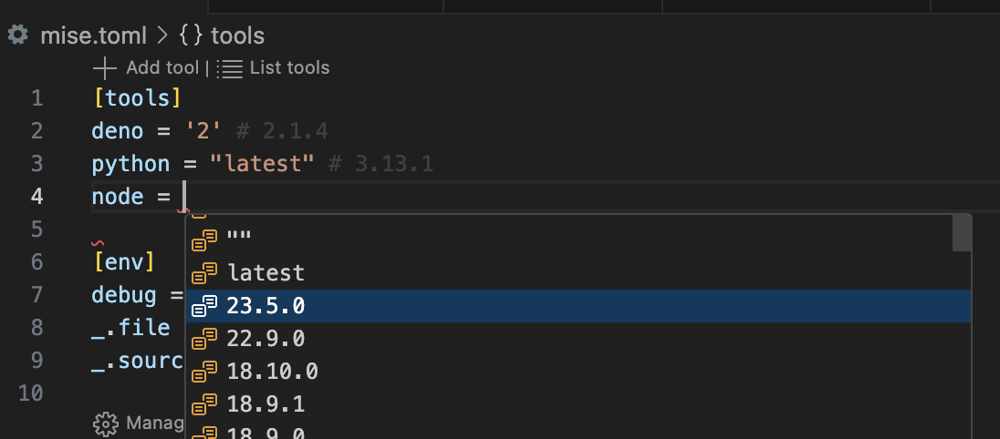
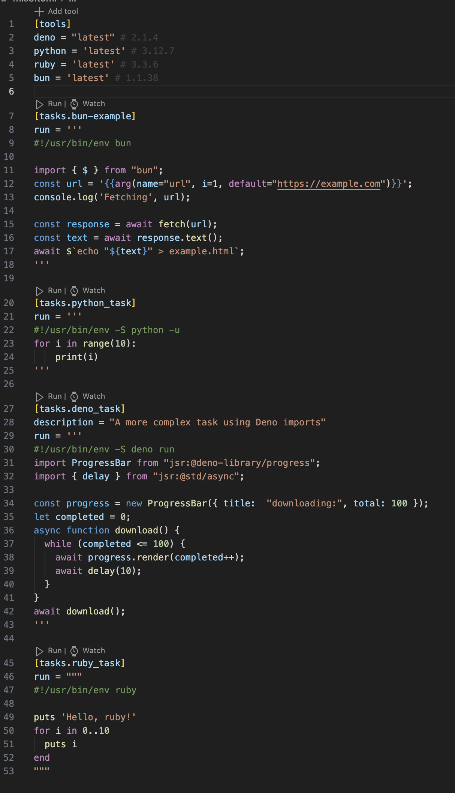

### Syntax Highlighting for TOML

[Even Better TOML](https://marketplace.visualstudio.com/items?itemName=tamasfe.even-better-toml)
is automatically installed as a dependency to handle syntax highlighting for
TOML files.

`mise-vscode` provides syntax highlighting for `tera` used for
[templating](https://mise.jdx.dev/templates.html) in `mise.toml` files

### Code completion

This extension will
[provide two JSON schemas](https://marketplace.visualstudio.com/items?itemName=tamasfe.even-better-toml#completion-and-validation-with-json-schema)
for code completion

- In `mise.*toml` files, https://mise.jdx.dev/schema/mise.json is automatically
  used
- In `*task[s]?.toml` files, it's using https://mise.jdx.dev/schema/mise-task.json

#### Autocompletion for tools 

Tool names and versions are autocompleted in the `tools` section of a `mise.toml` file.

#### Autocompletion for tasks

Code completion is provided for `depends = ["task_name"]`, `depends_post = ["task_name"]`, `wait_for = ["task_name"]`.

### Code lens features

This extension adds the following code lens features:

- Each task has a `run` and `watch` code lens that will run the task
- A `add tool` code lens that to automatically add a tool to a `mise.toml` file

### Code navigation

- Cmd/Ctrl+Click on an included file will open that file (example:
  `include = ["tasks.toml"`])

### Syntax highlighting for shebang

If you are using [multi-lines task script](https://mise.jdx.dev/tasks/toml-tasks.html#shell-shebang) with a shebang, syntax highlighting will be applied to the script.

The following languages are supported: Python, Node.js, Deno, Bun, Deno, Ruby, Bash, and Shell.

