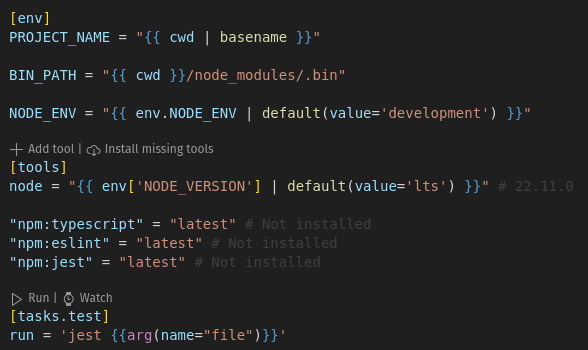
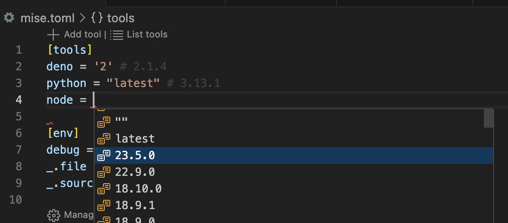
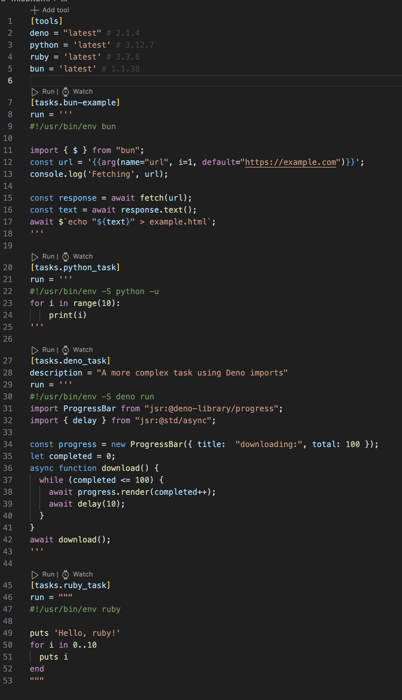

### Syntax Highlighting for TOML

This extension provides basic syntax highlighting for `mise.toml/mise.lock` files.
For the best experience with syntax highlighting and autocompletion in `mise.toml` files, you should install one of these TOML extensions:

- [Tombi TOML](https://marketplace.visualstudio.com/items?itemName=tombi-toml.tombi)
- [Even Better TOML](https://marketplace.visualstudio.com/items?itemName=tamasfe.even-better-toml)

The extension will notify you on startup if neither is installed.

`mise-vscode` associates the [mise JSON schema](https://mise.jdx.dev/schema/mise.json)
with all mise configuration files for these extensions, including environment and
platform-specific ones such as `mise.local.toml`, `mise.linux.toml`, or
`mise/config.macos-arm64.toml` (see [`auto_env`](https://mise.jdx.dev/configuration/environments.html)),
so autocompletion and validation work in all of them.

`mise-vscode` provides syntax highlighting for `tera` used for
[templating](https://mise.jdx.dev/templates.html) in `mise.toml` files



#### tasks_config.includes

If you use [`tasks_config.includes`](https://mise.jdx.dev/tasks/task-configuration.html#task-config-includes) to include some additional tasks files, add the following at the top of your file to get auto-completion and validation from `tombi` or `even-better-toml`.

```toml
#:schema https://mise.jdx.dev/schema/mise-task.json

[build]
run = "echo Hello, World!"
```

#### Autocompletion for tools 

Tool names and versions are autocompleted in the `tools` section of a `mise.toml` file.



In `.tool-versions` files, backend prefixes (`core:`, `npm:`, `cargo:`, ...) are
also autocompleted, and typing a prefix such as `core:` suggests the registry
tools of that backend (e.g. `core:node`).

### Tool stubs

[Tool stubs](https://mise.jdx.dev/dev-tools/tool-stubs.html) are executable
files (usually committed under `bin/`) whose body is TOML under a
`#!/usr/bin/env -S mise tool-stub` shebang:

```toml
#!/usr/bin/env -S mise tool-stub

version = "2.96.0"
tool = "github:cli/cli"
bin = "bin/gh"
```

The extension detects the shebang and opens stub files as TOML, so they get
syntax highlighting even though they have no `.toml` extension.

#### Autocompletion for tasks

Code completion is provided for `depends = ["task_name"]`, `depends_post = ["task_name"]`, `wait_for = ["task_name"]`.

`extends = "template_name"` completes the
[task templates](https://mise.jdx.dev/tasks/templates.html) declared in the file
being edited and in its parent config files. See the
[task templates section](/mise-vscode/reference/tasks/#task-templates) of the tasks
reference for the hover, go-to-definition, and find-references support.

### Task arguments (usage spec)

Task arguments are declared with the
[`usage` field](https://mise.jdx.dev/tasks/task-arguments.html) of a task,
using the [usage spec](https://usage.jdx.dev/spec/). The extension provides:

- **Syntax highlighting** of `usage = '''...'''` blocks (KDL)
- **Context-aware autocompletion**: directives (`arg`, `flag`, `complete`) at
  the start of a line, the attributes valid for that directive after it
  (`help`, `default`, `choices` blocks, `count`, `negate`, ...), without
  repeating attributes that are already set
- **Hover documentation** for directives and attributes
- **`$usage_*` variable completion**: typing `$` in a multiline `run` block
  suggests the `usage_*` environment variables derived from the args and
  flags of that task

```toml
[tasks.deploy]
usage = '''
arg "<environment>" help="Target environment" {
  choices "dev" "staging" "prod"
}
flag "-v --verbose" help="Enable verbose output"
'''
run = '''
echo "Deploying to ${usage_environment?}"
'''
```

#### File tasks

The same support is available in shell
[file tasks](https://mise.jdx.dev/tasks/file-tasks.html):

- `#USAGE` lines get usage spec syntax highlighting, autocompletion, and hover
- `#MISE` lines are highlighted as TOML, with autocompletion and hover for the
  [task configuration keys](https://mise.jdx.dev/tasks/task-configuration.html)
  (`description`, `alias`, `depends`, `sources`, ...)
- Typing `$` in the script body suggests the `usage_*` variables from the
  `#USAGE` lines

### Code lens features

This extension adds the following code lens features:

- Each task has a `run` and `watch` code lens that will run the task
- A `add tool` code lens that to automatically add a tool to a `mise.toml` file

### Code navigation

- Cmd/Ctrl+Click on an included file will open that file (example:
  `include = ["tasks.toml"`])
- Cmd/Ctrl+Click on `extends = "template_name"` opens the
  `[task_templates.template_name]` declaration; _Find all references_ on a
  declaration lists every task extending it

### Syntax highlighting for shebang

If you are using [multi-lines task script](https://mise.jdx.dev/tasks/toml-tasks.html#shell-shebang) with a shebang, syntax highlighting will be applied to the script.

The following languages are supported: Python, Node.js, Deno, Bun, Deno, Ruby, Bash, and Shell.



### While a config file is being edited

With auto save enabled, a config file is written while you are still typing it.
mise cannot read a file that does not parse, so every command fails until it
does.

Instead of clearing the panels, the extension keeps showing the last state it
could read. The status bar shows a warning while this is the case, and config
files that do not parse are marked in the activity bar.

If a command never succeeded, its error is shown as usual. Opening a project
with a config file that is already broken shows errors.

Running or watching a task is refused while a config file does not parse. You
get a message pointing at the file, instead of a mise error about a task that
does not exist.

The kept state is dropped when:

- the file parses again
- you save it yourself with `Cmd`/`Ctrl`+`S`
- you reload the configuration from the activity bar, the status bar or the
  command palette

Reloads the extension does on its own, for example after running a task, do not
drop it. There is no timeout: the state is kept for as long as the file does not
parse.
